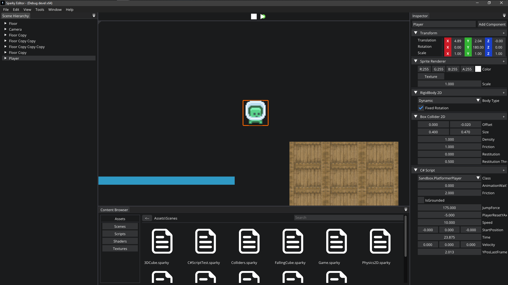

# Sparky Game Engine [](https://github.com/JShuk-7/Sparky/blob/master/LICENSE)


Sparky is an early-stage interactive application and rendering engine for Windows. Sparky is primarily a 2D engine with potential support for 3D comming in the near future. With that being said, you can still create a 3D looking scene with the features of the engine.

---

## Getting Started

Visual Studio 2022 is recommended, Sparky has not been tested with other development environments.

<ins>**1. Downloading the repository:**<ins>

Start by cloning the repository with the following command: </br>

(NOTE: if the repo was previously cloned non-recursively, you can use 'git submodule update --init' to retrieve the necessary submodules)

```bash
git clone --recursive "https://github.com/Jshuk-7/Sparky"
```

<ins>**2. Building the engine:**</ins>

Since there are currently no released binaries available, you must build the engine from source.

Run the [Win32-GenProjects.bat](https://github.com/JShuk-7/Sparky/blob/master/scripts/Win32-GenProjects.bat) file found in `scripts` folder. This will create a Visual Studio 2022 solution file that you can use to build the engine.

If you make changes to the engine, or if you want to regenerate project files, rerun the [Win32-GenProjects.bat](https://github.com/JShuk-7/Sparky/blob/master/scripts/Win32-GenProjects.bat) file found in the `scripts` folder.

---

## What to Expect in the Future

-   High-fidelity Physically-Based 3D rendering
-   Support for Mac, Linux, Android and IOS
-   Fully featured Vulkan Renderer
-   Integrated 3rd party 3D physics engine
-   Procedural terrain and world generation
-   Artificial Intelligence
-   Tree Graph editor system

---

## Preview
- A simple platformer game


- Imported 3D model with skybox

